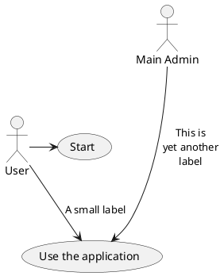
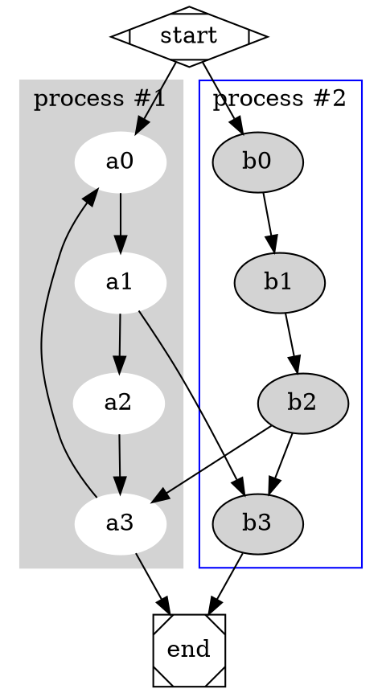
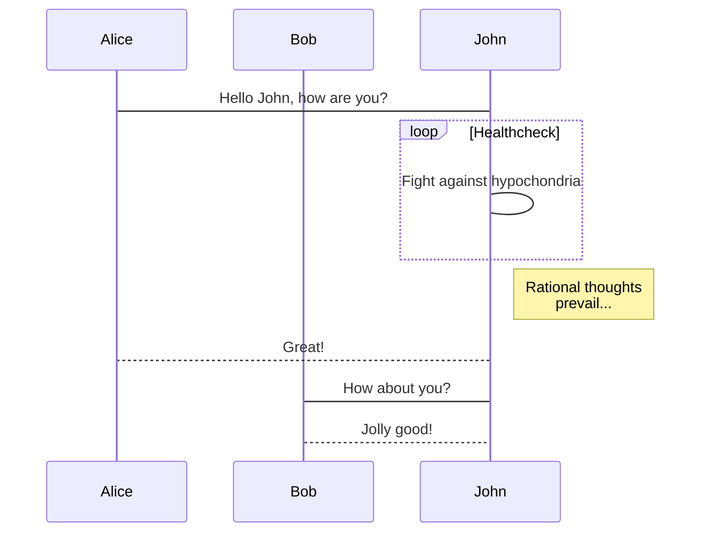

# ddemo

## Footnotes

$$  x = \dfrac{-b \pm \sqrt{b^2 - 4ac}}{2a} $$ 


```sequence
张三->李四: 嘿，小四儿, 写博客了没?
Note right of 李四: 李四愣了一下，说：
李四-->张三: 忙得吐血，哪有时间写。
```

```flow
st=>start: 开始
e=>end: 结束
op=>operation: 我的操作
cond=>condition: 确认？

st->op->cond
cond(yes)->e
cond(no)->op
```





```echarts
option = {
    xAxis: {
        type: 'category',
        data: ['Mon', 'Tue', 'Wed', 'Thu', 'Fri', 'Sat', 'Sun']
    },
    yAxis: {
        type: 'value'
    },
    series: [{
        data: [820, 932, 901, 934, 1290, 1330, 1320],
        type: 'line'
    }]
};
```





这是一个脚注：[^sample_footnote]


[1]	Actually, call by object reference would be a better description, since if a mutable object is passed, the caller will see any changes the callee makes to it (items inserted into a list).


[^sample_footnote]: 这里是脚注信息
